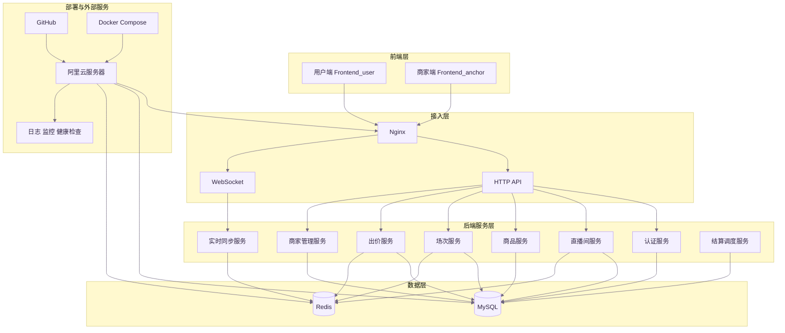
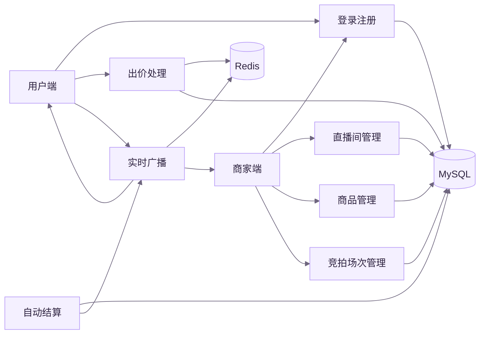

# 系统架构图

下面拆成两张图：

- 图 1：系统总体架构
- 图 2：核心业务调用关系

这样比把所有内容塞进一张图里更清楚，也更适合汇报展示。

## 图 1：系统总体架构

## 图 2：核心业务调用关系

## 如何使用

1. 在 VS Code 中打开本文件
2. 按 `Ctrl + Shift + V` 打开 Markdown 预览
3. 直接查看两张图
4. 如果要放进报告或 PPT，可以截图，或者复制到 Mermaid Live Editor 导出 PNG / SVG
